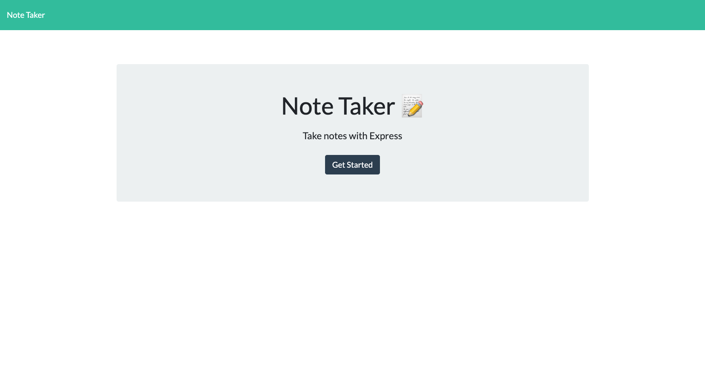

# Note Taker 3001

## Table of Contents

* [Description](#description)
* [Visuals](#visuals)
* [Usage](#usage)
* [Technologies](#technologies)
* [Licenses](#licenses)
* [Support](#support)
* [Authors](#authors)
* [Contributions](#contributions)

## Description

Welcome to the Note Taker 3001, where you can save your notes on a webpage so that you can access that information anywhere you have internet. You can save and delete notes, and then display them larger when you click on them. SImple, and easy to use!

## Visuals

The following image is of the landing page for the Note Taker 3001.

## Usage

To enjoy this application, you will visit the URL at this [link.](https://floating-hollows-16544.herokuapp.com/)

## Technologies

* Node JS
* Express

## Licenses

This application uses the MIT Software License. [Click here to view full license.](LICENSE)

## Support

Contact us at devonfaria@gmail.com if you need assistance downloading or activating this repository. You can also find me on [GitHub.](https://github.com/devonfaria)

## Authors

Devon Faria

## Contributions

